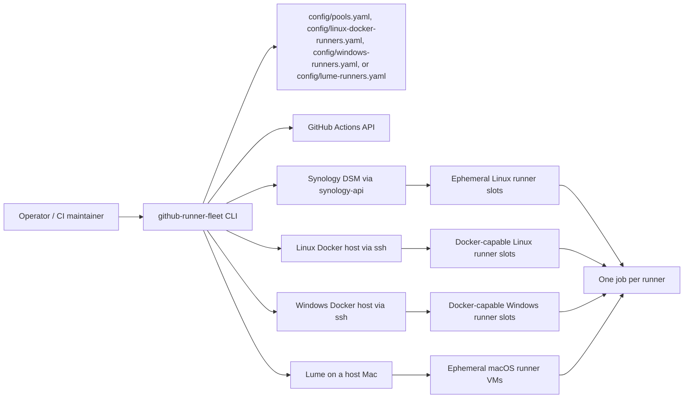

# GitHub Runner Fleet

Self-hosted GitHub runner infrastructure for Synology shell-only pools, Linux Docker hosts, Windows Docker hosts, and ephemeral Lume macOS VMs.

> Shell-only by design on Synology, ephemeral by default across the fleet, and explicit about what belongs on self-hosted capacity versus GitHub-hosted runners.

## Quick Links

- [Synology quick start](#synology-quick-start)
- [Linux Docker pool](#linux-docker-pool)
- [Windows Docker pool](#windows-docker-pool)
- [Lume macOS pool](#lume-macos-pool)
- [Supported workload matrix](#supported-workload-matrix)
- [Workflow cookbook](docs/workflow-cookbook.md)
- [Linux Docker examples](docs/linux-docker-pool.md)
- [Private-repo parity guide](docs/private-repo-parity.md)
- [Release image flow](#publishing-a-release-image)
- [Roadmap](ROADMAP.md)

## Roadmap Snapshot

| Status | Focus | Tracking |
| --- | --- | --- |
| Next | Unified preflight and health diagnostics for the whole fleet | [#26](https://github.com/OMT-Global/github-runner-fleet/issues/26) |
| Next | Synology deployment status and troubleshooting surfaces | [#29](https://github.com/OMT-Global/github-runner-fleet/issues/29) |
| Next | Shell-safe workflow cookbook and compatibility matrix follow-through | [#28](https://github.com/OMT-Global/github-runner-fleet/issues/28) |
| Later | Stronger Lume base-VM lifecycle and pool operations playbook | [#27](https://github.com/OMT-Global/github-runner-fleet/issues/27) |

The roadmap doc keeps the operator view short; the GitHub issues are the execution-level source of truth.

## Why This Exists

- Keep Synology runner capacity locked to shell-safe workloads instead of gradually drifting into privileged Docker-host territory.
- Give private repos dedicated Linux and Windows Docker execution planes for `container:` jobs, service containers, and platform-native container workflows.
- Give the org a second execution plane for macOS-native jobs through pooled Lume VMs without baking long-lived GitHub credentials into the base image.
- Make runner policy explicit in config and docs so downstream repos can tell, up front, which jobs belong on this fleet and which jobs should stay on GitHub-hosted runners.

## Fleet At A Glance

| Plane | Runtime | Best For | Explicitly Not For |
| --- | --- | --- | --- |
| Synology Linux pools | Ephemeral containers built from a multi-arch runner image | shell jobs, JS actions, Python `3.12`, Terraform, docs and validation work | Docker socket jobs, `container:` jobs, service containers, privileged workloads |
| Linux Docker pool | Ephemeral runner containers on a dedicated Linux Docker host | `container:` jobs, service containers, Docker daemon workflows, Buildx, Kind, heavier Linux integration | untrusted public fork PRs, macOS-native jobs, turning Synology into a Docker host |
| Windows Docker pool | Ephemeral Windows runner containers on a dedicated Windows Docker host | Windows container workflows, PowerShell automation, Windows x64 jobs that need self-hosted capacity | untrusted public fork PRs, Linux container jobs, macOS-native jobs |
| Lume macOS pool | Ephemeral VM clones from a sealed macOS base image | macOS-native build and test lanes that need a real macOS host | long-lived snowflake VMs, secrets baked into the base image, ad hoc manual drift |

## Topology



## Supported Workload Matrix

| Job Type | Synology shell-only pool | Linux Docker pool | Windows Docker pool | Lume macOS pool | GitHub-hosted still recommended |
| --- | --- | --- | --- | --- | --- |
| Node/npm validation | Yes | Yes | Yes | Yes | Optional |
| Python `3.12` workflows | Yes | Yes | Case-by-case | Yes | Optional |
| Terraform CLI validation | Yes | Yes | Case-by-case | Yes | Optional |
| Docs and shell scripts | Yes | Yes | Case-by-case | Yes | Optional |
| macOS-native build/test lanes | No | No | No | Yes | Optional |
| Windows-native build/test lanes | No | No | Yes | No | Optional |
| Multi-arch image publishing | No | Yes | No | No | Optional |
| `container:` jobs or service containers | No | Yes | Yes for Windows containers | No | Optional |
| Docker daemon workflows | No | Yes | Yes for Windows containers | No | Optional |
| Browser stacks and heavy system deps | Usually no | Case-by-case | Case-by-case | Case-by-case | Often |

## What You Get

- A custom multi-arch runner image based on the official `actions/runner` tarballs
- Built-in shell-job baseline tooling:
  - Node.js `18.20.8`
  - Python `3.12`
  - Terraform `1.6.6`
  - Docker CLI for the dedicated Linux Docker plane
  - `git`, `bash`, `tar`, `zstd`, and `procps`
- No Docker socket mounts on the Synology shell-only plane
- No privileged containers
- No host-network mode
- Two organization runner pools by default:
  - `synology-private`
  - `synology-public`
- One Linux Docker pool by default:
  - `linux-docker-private`
- The sample config starts with four private runner slots and two public runner slots.

The Synology shell-only class supports shell jobs, JavaScript actions, composite actions, the bundled shell-safe Node setup action, built-in Python `3.12` workflows, local `actions/setup-python@v6` resolution for Python `3.12`, and Terraform CLI workflows. Docker-based actions, `container:` jobs, and service containers belong on the dedicated Linux Docker plane instead.

## Repo Layout

- [config/pools.yaml](config/pools.yaml): non-secret pool config
- [config/linux-docker-runners.yaml](config/linux-docker-runners.yaml): Docker-capable Linux pool config
- [config/windows-runners.yaml](config/windows-runners.yaml): Docker-capable Windows pool config
- [docs/linux-docker-pool.md](docs/linux-docker-pool.md): examples for `container:`, `services:`, and Docker daemon workflows
- [docker/Dockerfile](docker/Dockerfile): runner image build
- [docker/runner-entrypoint.sh](docker/runner-entrypoint.sh): ephemeral registration and cleanup flow
- [src/cli.ts](src/cli.ts): config validation, compose rendering, and runner release helpers

## Synology Quick Start

1. Copy `.env.example` to `.env` and set `GITHUB_PAT`.
2. Edit `config/pools.yaml` for your organization, runner groups, and repository access policy.
3. Install dependencies:

```bash
pnpm install
```

4. Validate the config:

```bash
pnpm validate-config -- --config config/pools.yaml --env .env
```

5. Validate that the configured GitHub runner groups already exist in the target organization:

```bash
pnpm validate-github -- --config config/pools.yaml --env .env
```

This catches mismatched or missing `runnerGroup` values before Synology starts containers that would otherwise enter a restart loop.

6. Render the compose file:

```bash
pnpm render-compose -- --config config/pools.yaml --env .env --output docker-compose.generated.yml
```

The sample config uses `architecture: auto`, which lets Docker pull the native image variant from a multi-arch tag. If you pin `architecture` to `amd64` or `arm64`, Compose will force that platform explicitly.

If you set `resources.cpus` or `resources.pidsLimit`, `validate-config` and `render-compose` will warn because many Synology kernels reject Docker NanoCPUs, CPU CFS quotas, and PID cgroup limits. The sample config omits both limits for that reason.

7. Build the runner image:

```bash
./scripts/build-image.sh ghcr.io/your-org/github-runner-fleet:0.1.9 --push
```

When `--push` is used without an explicit `--platform`, the helper now defaults to `linux/amd64,linux/arm64` so the same tag works across Intel and ARM Synology models. A single-arch tag combined with the wrong `platform` or `architecture` setting will fail at startup with `Exec format error`.

Before you deploy a pushed tag, validate that the configured image tag is actually present in GHCR:

```bash
pnpm validate-image -- --config config/pools.yaml --env .env
```

8. Deploy the generated compose file to Synology Container Manager and start the stack.

For a fully programmatic install from your workstation, this repo can also reuse your local [synology-api](https://github.com/N4S4/synology-api) checkout to stage the compose project and trigger `docker compose up -d` on the NAS through DSM Task Scheduler:

```bash
pnpm render-synology-project-manifest -- --config config/pools.yaml --env .env
pnpm install-synology-project -- --config config/pools.yaml --env .env
pnpm drain-pool -- --pool synology-private --plane synology --timeout 15m --format json --config config/pools.yaml --env .env
pnpm teardown-synology-project -- --config config/pools.yaml --env .env
```

That installer path:

- uploads `compose.yaml` plus a project-local `.env` into `SYNOLOGY_PROJECT_DIR`
- creates a one-shot root Task Scheduler task through `synology-api`
- runs `docker compose -p $COMPOSE_PROJECT_NAME up -d --force-recreate --remove-orphans`
- deletes the temporary scheduled task after completion

`install-synology-project` is the recreate/resize path. If you change [config/pools.yaml](config/pools.yaml) from four private runners to two, or from two public runners to six, rerun `pnpm install-synology-project ...` and the generated compose project will reconcile to the new slot counts. `--force-recreate` refreshes existing services, and `--remove-orphans` removes slots that no longer exist in the rendered compose file.

Use `pnpm drain-pool ...` before planned maintenance to remove idle runners from GitHub dispatch and wait for busy runners to finish. Teardown commands also accept `--drain --drain-timeout 15m` when you want that drain gate inline before `docker compose down`.

Use `pnpm teardown-synology-project ...` when you want an explicit `docker compose down` on the NAS before reinstalling or when you want the runner project fully stopped.

It intentionally avoids undocumented `SYNO.Docker.Project create/import` calls. If the Synology Docker daemon can see the compose project normally, Container Manager should still surface it as a compose project after the install task runs.

## Linux Docker Pool

This repo now also carries a separate Linux control plane for Docker-capable private workloads under [config/linux-docker-runners.yaml](config/linux-docker-runners.yaml). It keeps the runner ephemeral and one-job-per-runner, but stages those runners on a dedicated Linux Docker host instead of the Synology NAS.

Use this plane for:

- `container:` jobs
- service containers
- Docker daemon and Buildx workflows
- Kind or heavier Linux integration suites

Useful Linux Docker commands:

```bash
pnpm validate-linux-docker-config -- --config config/linux-docker-runners.yaml --env .env
pnpm validate-linux-docker-github -- --config config/linux-docker-runners.yaml --env .env
pnpm render-linux-docker-compose -- --config config/linux-docker-runners.yaml --env .env --output docker-compose.linux-docker.yml
pnpm render-linux-docker-project-manifest -- --config config/linux-docker-runners.yaml --env .env
pnpm install-linux-docker-project -- --config config/linux-docker-runners.yaml --env .env
pnpm drain-pool -- --pool linux-private --plane linux-docker --timeout 15m --linux-config config/linux-docker-runners.yaml --env .env
pnpm teardown-linux-docker-project -- --config config/linux-docker-runners.yaml --env .env
```

The installer path uses `ssh` and `scp` to stage `compose.yaml`, a project-local `.env`, and a generated deployment script onto `LINUX_DOCKER_HOST`, then runs `docker compose up -d` or `docker compose down` there. Keep access key-based and host-managed; do not bake long-lived GitHub credentials into the runner image.

Recommended workflow labels:

- Docker-capable private repos: `runs-on: [self-hosted, linux, docker-capable, private]`

## Windows Docker Pool

This repo also carries a Windows control plane for Docker-capable private workloads under [config/windows-runners.yaml](config/windows-runners.yaml). It stages ephemeral Windows runner containers on a dedicated Windows Server or Windows Docker host reachable over OpenSSH.

Useful Windows Docker commands:

```bash
pnpm validate-windows-config -- --config config/windows-runners.yaml --env .env
pnpm validate-windows-github -- --config config/windows-runners.yaml --env .env
pnpm render-windows-compose -- --config config/windows-runners.yaml --env .env --output docker-compose.windows.yml
pnpm render-windows-project-manifest -- --config config/windows-runners.yaml --env .env
pnpm install-windows-project -- --config config/windows-runners.yaml --env .env
pnpm drain-pool -- --pool windows-private --plane windows-docker --timeout 15m --windows-config config/windows-runners.yaml --env .env
pnpm teardown-windows-project -- --config config/windows-runners.yaml --env .env
```

The installer path uses `ssh` and `scp` to stage `compose.yaml`, a project-local `.env`, and a generated PowerShell deployment script onto `WINDOWS_DOCKER_HOST`, then runs `docker compose up -d` or `docker compose down` there. Runner containers mount the Windows Docker named pipe and register as ephemeral organization runners.

Recommended workflow labels:

- Docker-capable Windows private repos: `runs-on: [self-hosted, windows, docker-capable, private]`

## Day-0 Operator Flow

1. Validate the config and GitHub runner groups before touching Synology, Linux Docker, Windows Docker, or Lume.
2. Render the manifest or compose output you intend to deploy.
3. Publish or verify the image tag before pointing a live pool at it.
4. Install or reconcile the target plane.
5. Run an acceptance workflow that matches the runner class you just changed.

## Publishing A Release Image

Use [release-image.yml](.github/workflows/release-image.yml) for published tags instead of relying on an ad hoc local push. The workflow runs on GitHub-hosted runners, not the Synology shell-only pool, because it needs multi-arch Buildx, QEMU, and registry publish support.

The release workflow:

- enforces that `package.json` version matches `config/pools.yaml` image tag
- validates `config/pools.yaml`
- runs the local `pnpm smoke-test` contract on `linux/amd64`
- publishes the configured tag from `config/pools.yaml`
- verifies the pushed tag with `docker buildx imagetools inspect`
- confirms both `linux/amd64` and `linux/arm64` are present
- retries `pnpm validate-image` until the GitHub Packages API sees the new tag
- runs post-publish toolchain checks for both `linux/amd64` and `linux/arm64`
- can create the matching GitHub release tag `v<version>` when dispatched from `main` with `publish_project_release=true`

Only point [config/pools.yaml](config/pools.yaml) at a tag that this workflow has already published and verified.

If you want the repository release and GHCR image tag to stay aligned, merge the version bump to `main` first and then run the release workflow from `main` with `publish_project_release=true`. That will create the repo tag and GitHub Release after the image publish/verify steps succeed.

## Runtime Contract

- Each service handles one job, de-registers, and restarts cleanly.
- GitHub registration and removal both use short-lived tokens minted from the configured PAT.
- Public and private repos use separate runner groups and labels.
- `repositoryAccess: all` is the org-wide mode for a runner group.
- `repositoryAccess: selected` requires `allowedRepositories` and documents the intended selected-repo set for that pool.
- Public repos must not receive long-lived secrets from this runner class.
- GitHub enforces repo access on the runner group side; this repo carries that policy into validation, metadata, and rendered compose output.
- The image keeps the official runner bundle under `/actions-runner` as a read-only source and copies it into a writable per-runner home under `RUNNER_STATE_DIR` before startup.
- The runner work tree is container-local at `RUNNER_WORK_DIR=/tmp/github-runner-work` so Actions temp extraction does not inherit Synology bind-mount ownership restrictions.
- The image exposes a dedicated container-local Actions temp directory at `RUNNER_TEMP=/tmp/github-runner-temp` and a hosted tool cache at `RUNNER_TOOL_CACHE=/opt/hostedtoolcache` so shell-safe tool bootstrap actions do not depend on Synology bind-mount ownership semantics.
- In root-fallback mode, the entrypoint will recreate those container-local runtime directories if Synology rejects an in-place permission refresh, instead of crashing the container during startup.
- On Synology bind mounts that reject `chown`, the entrypoint falls back to root runner execution with `RUNNER_ALLOW_RUNASROOT=1` so the service can still start cleanly from that writable runner home.
- The writable-home copy intentionally extracts without restoring archive ownership, so Synology mounts do not emit a `tar: Cannot change ownership ... Operation not permitted` line for every runner file.

Recommended workflow labels:

- Private repos: `runs-on: [self-hosted, synology, shell-only, private]`
- Public repos: `runs-on: [self-hosted, synology, shell-only, public]`

## Reusable Setup Actions

For Node projects on shell-only runners, use the bundled action instead of `actions/setup-node`:

```yaml
- uses: OMT-Global/github-runner-fleet/actions/setup-shell-safe-node@main
  with:
    node-version: 24.14.1
```

Use that action on self-hosted Synology runners where `actions/setup-node` would otherwise fail while extracting tool archives. Keep `actions/setup-node` on GitHub-hosted jobs.

The shell-only runner image directly supports these job profiles without Docker or service containers:

- Node `18` plus `npm` with `actions/cache`
- Node `24` when bootstrapped through `OMT-Global/github-runner-fleet/actions/setup-shell-safe-node`
- Python `3.12` plus `pip` with `actions/cache`
- `actions/setup-python@v6` when `python-version: '3.12'`
- Terraform `1.6.6` plus plugin-cache directories under `RUNNER_TEMP`
- Bash/docs validation jobs that only need the standard CLI toolchain

For Python projects, the runner image already carries Python `3.12` and exposes that exact interpreter through `RUNNER_TOOL_CACHE`, so `actions/setup-python@v6` with `python-version: '3.12'` resolves locally on these runners instead of attempting a distro-specific download. Repos that only need `3.12` can stay on the shell-only pool. Repos with Python version matrices should keep the non-`3.12` lanes on GitHub-hosted runners and only route the built-in `3.12` lane to self-hosted runners.

For OpenClaw Ouro style workflows, the Node/npm validators, docs checks, Python `3.12` linting, Terraform validation, and smoke scripts that stay within bash plus the baked-in toolchain belong on Synology. `container:`, `services:`, browser, and Docker-daemon jobs belong on the Linux Docker plane. macOS-native lanes belong on Lume.

## Lume macOS Pool

This repo now also carries a separate host-side control plane for pooled macOS runner VMs under [config/lume-runners.yaml](config/lume-runners.yaml). This is not a macOS container path. `lume` runs full macOS VMs, and the host scripts recycle per-slot VM clones from a sealed base VM so the job host itself is ephemeral.

The Lume flow is:

- create and seal a base VM such as `macos-runner-base`
- run [scripts/lume/reconcile-pool.sh](scripts/lume/reconcile-pool.sh) on the host MacBook
- let each slot clone boot, receive bootstrap assets over `lume ssh`, register one ephemeral runner in `macos-private`, run one job, and get destroyed

Useful Lume commands:

```bash
pnpm validate-lume-config -- --config config/lume-runners.yaml --env .env
pnpm validate-lume-github -- --config config/lume-runners.yaml --env .env
pnpm render-lume-runner-manifest -- --config config/lume-runners.yaml --env .env --slot 1
pnpm drain-pool -- --pool macos-private --plane lume --timeout 15m --lume-config config/lume-runners.yaml --env .env
bash scripts/lume/create-base-vm.sh --config config/lume-runners.yaml --env .env
bash scripts/lume/setup-base-vm.sh --config config/lume-runners.yaml --env .env
bash scripts/lume/reconcile-pool.sh --config config/lume-runners.yaml --env .env
bash scripts/lume/status.sh --config config/lume-runners.yaml --env .env
```

Keep the Lume runner env file outside git and locked down with `chmod 600`. The host controller reads that file and copies it into each guest VM just before starting the guest bootstrap. Do not bake GitHub credentials into the base VM image.

`create-base-vm.sh` now caches the macOS IPSW under `LUME_RUNNER_BASE_DIR/cache/` by default so rebuilding the base image does not re-download the restore image every time. Override that path with `LUME_RUNNER_IPSW_PATH` if you want the cache elsewhere. If unattended setup drifts or gets interrupted, rerun `scripts/lume/setup-base-vm.sh` against the existing base VM instead of deleting and recreating it.

## Security Notes

- No extra NAS shares should be mounted into the runner services.
- Do not publish ports from the runner containers.
- Keep resource limits enabled in `config/pools.yaml`.
- Prefer memory-only limits on Synology. Only set `resources.cpus` or `resources.pidsLimit` if you have verified your NAS kernel supports Docker CPU CFS quotas and PID cgroup limits.
- Do not add Compose `init: true` for these services. The image already uses `tini`, and double-init setups on Synology produce noisy subreaper warnings.
- For public pools, use DSM firewall rules to reduce unnecessary LAN reachability.
- Keep the Docker socket restricted to the dedicated Linux Docker host. Do not mount it into the Synology shell-only plane.

## Useful Commands

```bash
pnpm doctor -- full --env .env
pnpm doctor -- synology --env .env
pnpm doctor -- lume --env .env
pnpm validate-linux-docker-config -- --config config/linux-docker-runners.yaml --env .env
pnpm validate-linux-docker-github -- --config config/linux-docker-runners.yaml --env .env
pnpm validate-config -- --config config/pools.yaml --env .env
pnpm validate-github -- --config config/pools.yaml --env .env
pnpm validate-image -- --config config/pools.yaml --env .env
pnpm drain-pool -- --pool synology-private --plane synology --timeout 15m --format json --config config/pools.yaml --env .env
pnpm render-linux-docker-compose -- --config config/linux-docker-runners.yaml --env .env --output docker-compose.linux-docker.yml
pnpm render-linux-docker-project-manifest -- --config config/linux-docker-runners.yaml --env .env
pnpm install-linux-docker-project -- --config config/linux-docker-runners.yaml --env .env
pnpm teardown-linux-docker-project -- --config config/linux-docker-runners.yaml --env .env
pnpm render-compose -- --config config/pools.yaml --env .env --output docker-compose.generated.yml
pnpm render-synology-project-manifest -- --config config/pools.yaml --env .env
pnpm install-synology-project -- --config config/pools.yaml --env .env
pnpm teardown-synology-project -- --config config/pools.yaml --env .env
pnpm check-runner-version -- --env .env
pnpm runner-release-manifest -- --env .env
pnpm smoke-test
```

## Observability

`pnpm doctor` keeps its normal stdout report, and also emits one structured JSON log line per check to stderr. Each line includes `level`, `msg`, `plane`, `pool`, and `ts` fields so log collectors can ingest the output without parsing the human report.

Metrics are opt-in. Set `METRICS_ENDPOINT` to an HTTP endpoint to receive Prometheus text-format samples for doctor check results, pool slot counts, and runner token fetch duration measurements:

```bash
METRICS_ENDPOINT=https://metrics.example.internal/ingest pnpm doctor -- full --env .env
```

## Local Smoke Test

Run this from a machine with a live Docker daemon and Buildx support:

```bash
pnpm smoke-test
```

The smoke test:

- builds the local runner image
- verifies the built-in Python `3.12` tool-cache entry resolves to the baked-in interpreter
- starts a mock GitHub token API on an isolated Docker network
- mounts stubbed `config.sh` and `run.sh` files into `/actions-runner` as the read-only runner source
- verifies registration token fetch, runner config flags, run invocation, remove token fetch, and cleanup for both the normal runner-user mode and the Synology-style root-fallback mode

Useful overrides:

```bash
DOCKER_CONTEXT=colima pnpm smoke-test
SMOKE_PLATFORM=linux/amd64 pnpm smoke-test
SMOKE_KEEP_ARTIFACTS=1 pnpm smoke-test
```

## Troubleshooting Starting Points

- `pnpm doctor -- full --env .env` for one preflight/status summary across Synology and Lume checks
- `pnpm validate-linux-docker-config -- --config config/linux-docker-runners.yaml --env .env` for Docker-capable Linux pool schema and label validation
- `pnpm validate-linux-docker-github -- --config config/linux-docker-runners.yaml --env .env` for Docker-capable Linux runner-group verification
- `pnpm render-linux-docker-project-manifest -- --config config/linux-docker-runners.yaml --env .env` for the remote Linux Docker install plan before you push it
- `pnpm validate-config -- --config config/pools.yaml --env .env` for schema, resource, and policy mismatches
- `pnpm validate-github -- --config config/pools.yaml --env .env` for missing runner groups or GitHub auth failures
- `pnpm validate-image -- --config config/pools.yaml --env .env` for GHCR tag drift before deploy
- `pnpm validate-lume-config -- --config config/lume-runners.yaml --env .env` for macOS pool config validation
- `bash scripts/lume/status.sh --config config/lume-runners.yaml --env .env` for current host-side Lume slot state
- [docs/private-repo-parity.md](docs/private-repo-parity.md) for routing rules and the remaining GitHub-hosted gaps
- [docs/linux-docker-pool.md](docs/linux-docker-pool.md) for Docker-capable workflow examples and host expectations
- [ROADMAP.md](ROADMAP.md) for the next diagnostic surfaces planned in this repo

## Manual Acceptance Checklist

- Build and launch both pools on the Synology NAS
- Validate and install the Linux Docker pool on the dedicated Docker host
- Verify both runner groups appear online in GitHub
- Verify the Linux Docker runner group appears online with the `docker-capable` label contract
- Verify the private runner group is set to the repo access policy you intend, such as "All repositories" for an org-wide private pool
- Verify the generated compose file does not pin `platform:` unless you intentionally forced `architecture`
- Run a private-repo shell workflow with secrets
- Run a private-repo `container:` or `services:` workflow on the Linux Docker plane
- Run a public-repo shell workflow without secrets
- Run a self-hosted workflow that uses `OMT-Global/github-runner-fleet/actions/setup-shell-safe-node@<ref>`
- Run a self-hosted workflow that uses `actions/setup-python@v6` with `python-version: '3.12'`
- Verify `python3 --version` reports `3.12.x` and `terraform version` reports `1.6.6`
- Confirm each job de-registers the runner and the service restarts cleanly
- Confirm there is no Docker socket mount in the rendered compose file
